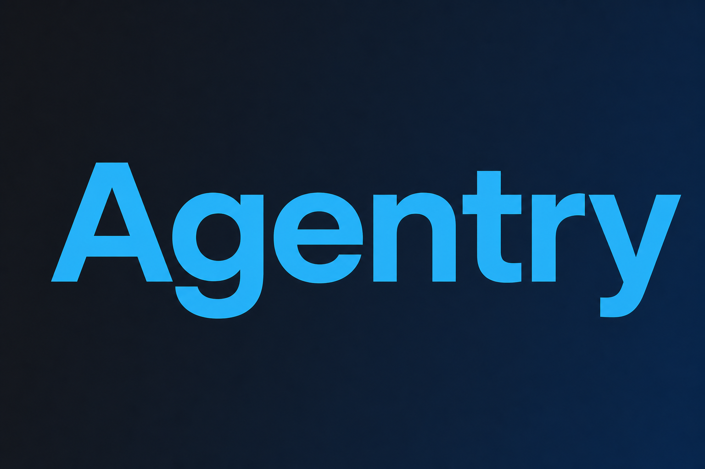

<div align="center">



# Agentry

**Install agents, skills, rules, scripts, and profiles onto coding agents — from any Git repo.**

Supports **Cursor**, **Claude Code**, **Codex**, **OpenCode**, and [70+ more](#supported-agents).

[](https://www.npmjs.com/package/@mhmdreza-rafiei/agentry)
[](#install)
[](LICENSE)
[](https://github.com/mhmdreza-rafiei/agentry)

</div>

## Install

```bash
npm install -g @mhmdreza-rafiei/agentry
# or
npx @mhmdreza-rafiei/agentry@latest --help
```

## Quick start

```bash
# Browse + install skills from a repo
agentry add skills mhmdreza-rafiei/agent-tools

# Install one skill to Cursor
agentry add skills mhmdreza-rafiei/agent-tools enhance-prompt -a cursor

# See what is installed
agentry list
agentry list skills
```

## Commands

| Command | Description |
| --- | --- |
| `agentry add <kind> <source> [selector]` | Discover and install artifacts |
| `agentry add profile <name> [source]` | Apply a local `profile/<name>.yaml` bundle |
| `agentry list` | List installed artifacts |
| `agentry list <kind>` | List installed artifacts of one kind |
| `agentry list <source> [kind] [selector]` | List what a repo/path contains |
| `agentry remove <kind> [source] [selector]` | Remove installs (files + lock) |
| `agentry update [kind] [source] [selector]` | Re-install from source or lockfile |
| `agentry init <kind> [name] [category]` | Scaffold a new artifact |
| `agentry update` | Update the Agentry CLI itself |
| `agentry uninstall` | Uninstall the Agentry CLI |

`<kind>` is `skill | rule | agent | profile | script` (plurals accepted).

### Source formats

```bash
# GitHub shorthand
agentry add skills mhmdreza-rafiei/agent-tools

# Full GitHub URL
agentry add skills https://github.com/mhmdreza-rafiei/agent-tools

# Tree URL (subdir + ref)
agentry add skills https://github.com/mhmdreza-rafiei/agent-tools/tree/main/skills

# Local path
agentry add skills ./my-skills

# Any git URL
agentry add skills git@github.com:mhmdreza-rafiei/agent-tools.git
```

### Options

| Option | Description |
| --- | --- |
| `-g, --global` | Install into `~` (all projects) |
| `--project` | Install into the current folder (default) |
| `--dir <path>` | Install into a specific folder |
| `-a, --agent <name>` | Target provider(s); repeatable; `*` = all |
| `-l, --list` | Preview only — write nothing |
| `--copy` | Copy instead of symlink for non-universal agents |
| `--all` | Install everything to all agents, no prompts |
| `-y, --yes` | Skip prompts |
| `--description <text>` | `init`: frontmatter description |
| `--alwaysApply` | `init` rule: `alwaysApply: true` |
| `--reference` / `--no-reference` | `init` skill: include `references/TEMPLATE.md` |
| `--skills` / `--agents` / `--rules` / `--scripts` `[src]` | `init` profile: include kinds (optional source) |

## Examples

```bash
# List everything in a catalog repo
agentry list mhmdreza-rafiei/agent-tools
agentry list mhmdreza-rafiei/agent-tools skills
agentry list mhmdreza-rafiei/agent-tools skills enhance-prompt

# Install
agentry add skills mhmdreza-rafiei/agent-tools
agentry add skills mhmdreza-rafiei/agent-tools enhance-prompt -a cursor -a claude-code
agentry add rules mhmdreza-rafiei/agent-tools ask-dont-guess
agentry add agents mhmdreza-rafiei/agent-tools frontend-developer

# Inventory
agentry list
agentry list skills

# Update / remove by selector or by install source
agentry update skills mhmdreza-rafiei/agent-tools
agentry remove skills enhance-prompt
agentry remove skills mhmdreza-rafiei/agent-tools

# Scaffold
agentry init skill enhance-prompt prompt --reference
agentry init rule ask-dont-guess --alwaysApply --description "Ask before guessing"
agentry init profile frontend --skills mhmdreza-rafiei/agent-tools -a cursor
```

Example catalog used throughout this README: [`mhmdreza-rafiei/agent-tools`](https://github.com/mhmdreza-rafiei/agent-tools).

## How it works

1. Resolve a source (local path or shallow git clone).
2. Discover artifacts under `<kind>s/` **and** root markers (`SKILL.md`, `.mdc`).
3. Let you pick what to install (searchable list + `All`).
4. Install once to `.agents/skills/<id>` for universal providers; symlink (or `--copy`) for others.
5. Track installs in `.agentry/lock.json` for remove/update.

If a clone fails and a prior cache exists, Agentry asks whether to load from cache (`~/.cache/agentry/repos`).

## Artifact layouts

Author installable tools in a source repo like this:

### Skills

```text
skills/
  enhance-prompt/
    SKILL.md
    references/
      TEMPLATE.md
  prompt/
    rewrite/
      SKILL.md
```

### Agents / rules

```text
agents/
  frontend-developer.mdc
rules/
  ask-dont-guess.mdc
```

### Scripts / profiles

```text
scripts/
  deploy/
    README.md
profiles/
  frontend.yaml
```

Local install profiles (consumed by `agentry add profile`) live at `profile/<name>.yaml`.

## Supported agents

Agentry targets **70+** providers. Universal providers share `.agents/skills/`; others get a symlink or copy.

| Agent | Skills path |
| --- | --- |
| Cursor | `.agents/skills` |
| Codex | `.agents/skills` |
| OpenCode | `.agents/skills` |
| Gemini CLI | `.agents/skills` |
| Claude Code | `.claude/skills` |
| Windsurf | `.windsurf/skills` |
| … | see `src/registry/agents.ts` |

## Development

```bash
npm install
npm run typecheck
npm test
npm run build
node dist/cli.mjs --help
```

Requires **Node ≥ 22.20**.

## License

[MIT](LICENSE)
